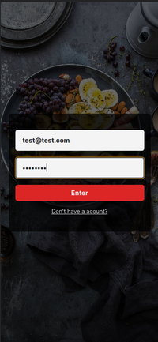
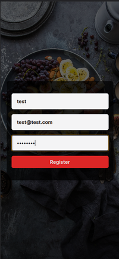
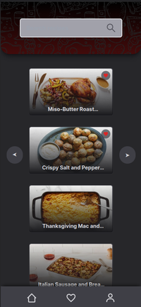
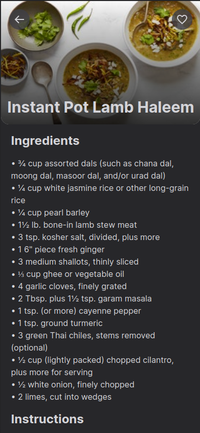
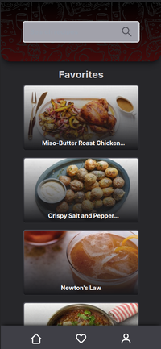

# Frontend do Projeto de Receitas

Este é o frontend do projeto de receitas, desenvolvido utilizando as seguintes tecnologias:

- Next.js: Um framework React para construção de interfaces web.
- Tailwind CSS: Uma biblioteca de CSS utilitária para estilização rápida e responsiva.
- TypeScript: Uma linguagem de programação para adicionar tipagem estática ao JavaScript.
- React Hook Form: Uma biblioteca para criação de formulários com validação.
- Zod: Uma biblioteca de validação de esquemas para TypeScript.

## Funcionalidades

### 1. Tela Inicial


Tela inícial da aplicação.

### 2. Login de Usuário



Os usuários podem fazer login em suas contas para acessar as funcionalidades da aplicação.

### 3. Cadastrar Usuário



Os usuários podem criar uma conta para acessar a aplicação.
### 4. Listar e Buscar Receitas



Os usuários podem visualizar uma lista de receitas existentes ou buscar uma receita pelo campo de busca.

### 4. Detalhes da receita



Os usuários podem visualizar os ingredientes e modo de preparo de uma receita.

### 4. Ver Receitas Favoritas



Os usuários podem ver quais são as receitas que eles favoritaram.

## Configuração do Ambiente

Para configurar o ambiente de desenvolvimento do frontend, você precisará ter o Docker e o Docker Compose instalados em sua máquina. Essas ferramentas facilitarão a criação e execução dos containers necessários para a aplicação.

Siga as instruções fornecidas no [README](../README.md) principal do projeto para iniciar os containers utilizando o Docker Compose. Isso criará os ambientes de desenvolvimento do frontend, backend e banco de dados, prontos para serem utilizados.

## Testes

O frontend deste projeto de receitas utiliza o React Testing Library em conjunto com o Jest para realizar testes unitários e de integração. Essas ferramentas são amplamente utilizadas na comunidade React para garantir a qualidade e a estabilidade do código.

### React Testing Library

A React Testing Library é uma biblioteca de testes focada em testar os componentes React da mesma forma que os usuários interagem com eles.

### Jest

O Jest é um framework de testes em JavaScript amplamente utilizado para projetos React. Ele fornece uma série de recursos poderosos para facilitar a escrita e a execução de testes.

### Executando os Testes

Para executar os testes no frontend do projeto, siga as etapas abaixo:

1. Certifique-se de que as dependências do projeto estejam instaladas. No diretório raiz do projeto, execute o seguinte comando para instalar as dependências:

```
npm install
```

2. Após a conclusão da instalação das dependências, execute o seguinte comando para executar os testes:

```
npm test
```
Isso iniciará a execução dos testes utilizando o Jest.

## Contribuição

Se você deseja contribuir para este projeto, sinta-se à vontade para abrir um Pull Request. Certifique-se de descrever detalhadamente as alterações propostas.

## Licença

Este projeto está licenciado sob a [MIT License](https://opensource.org/licenses/MIT).
